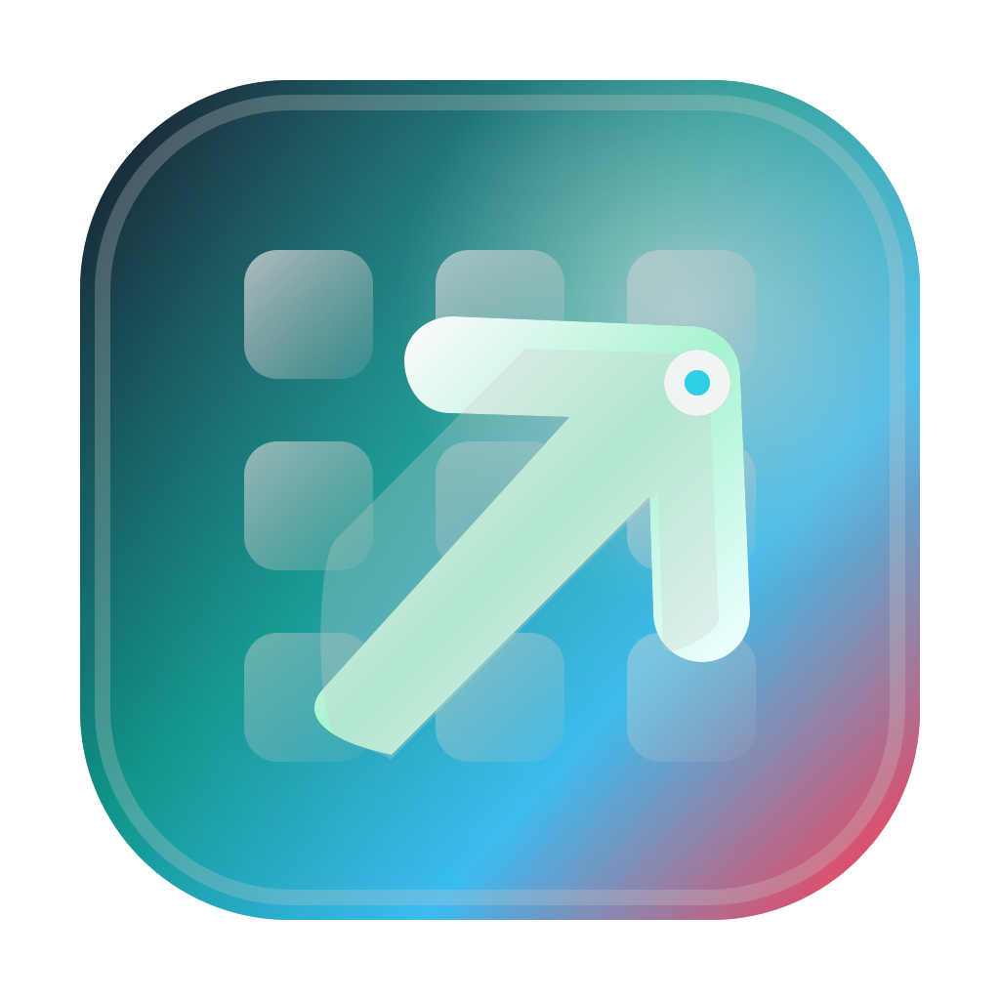

# MacLauncher

MacLauncher is a native macOS launcher built with SwiftUI and AppKit.



## Requirements

- macOS 15 or newer
- Swift 6 toolchain

This repository uses Swift Package Manager so it can build with command-line tools.

## Build

```sh
swift build
```

## Run

```sh
swift run MacLauncher
```

The app opens a resizable macOS window, scans standard application folders, and displays installed apps in a grid.
The terminal command keeps running while the app is open. Quit the app or close the window to return to the shell prompt.

## Test

```sh
swift test
```

## Package

Build a local macOS installer package:

```sh
scripts/build-installer.sh
```

The script builds a release binary, wraps it in `MacLauncher.app`, ad-hoc signs the app, and writes an installer package to `.build/installer/MacLauncher-0.0.2.pkg`.
The packaged app includes the app icon from `Sources/MacLauncher/Resources/AppIcon.icns` and embeds the current git commit in `Info.plist`.

Optional environment variables:

- `VERSION=0.2.0`
- `GIT_COMMIT=$(git rev-parse HEAD)`
- `BUILD_CONFIG=debug`
- `BUNDLE_ID=com.example.MacLauncher`
- `CODE_SIGN_IDENTITY="Developer ID Application: Example"`
- `CODE_SIGN_IDENTITY=skip`
- `PKG_SIGN_IDENTITY="Developer ID Installer: Example"`
- `PKG_OUTPUT=/tmp/MacLauncher.pkg`

Install the generated package with Finder or:

```sh
sudo installer -pkg .build/installer/MacLauncher-0.0.2.pkg -target /
```

## Current scope

Completed vertical slice:

- scan `/Applications`, `/System/Applications`, and `~/Applications`
- create stable app IDs from bundle identifiers with path fallback
- show installed apps in a scrollable SwiftUI grid
- launch apps through `NSWorkspace`
- manually refresh the app catalog
- load app icons through a replaceable icon loader
- activate and foreground the app window when launched from `swift run`
- build a local `.pkg` installer that installs `MacLauncher.app` into `/Applications`
- modern app logo and packaged `.icns` app icon
- runtime app icon when launched through `swift run`
- background transparency setting, defaulting to 30%
- optional bottom-left app load time display in milliseconds
- bottom-right version and commit labels with GitHub repository and commit links
- fixed-size launcher window with rounded corners, no titlebar, no close/minimize/zoom traffic-light buttons, and no menu sizing commands
- custom groups with a group shelf, drag/drop into groups, nested group panel, rename, delete, and move in/out support
- persistent catalog cache and async icon loading for faster perceived startup

## Settings

Open macOS app settings with `Command-,`.

- `Background Transparency`: controls how transparent the launcher window background is, from `0%` opaque to `100%` clear. The default is `30%`.

Not yet implemented:

- search UI
- custom ordering and persistence in the main UI
- drag and drop
- groups
- full-screen overlay
- global hotkey
- notarized release package

## Icon Assets

Regenerate the app icon after changing the vector/source drawing:

```sh
scripts/generate-app-icon.swift
```

Tracked icon files:

- `Assets/AppIcon/AppIcon.svg`
- `Assets/AppIcon/AppIcon.png`
- `Sources/MacLauncher/Resources/AppIcon.icns`
